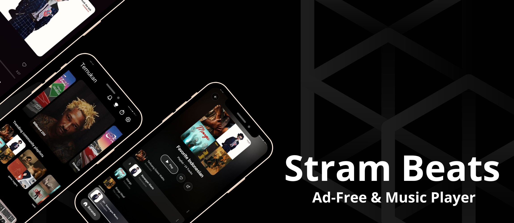
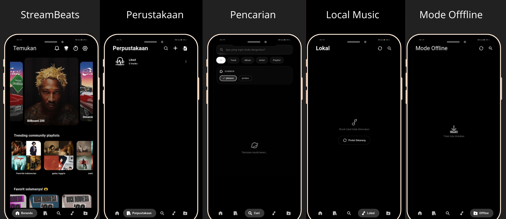

# 🎵 StreamBeats

**Pemutar musik streaming lokal dan berbasis plugin, dibangun dengan Flutter & Rust.**

  
  
  
   
  
  
  

**StreamBeats** adalah pemutar musik open-source eksperimental yang dirancang untuk memberikan kebebasan penuh atas audio Anda. Gabungkan musik lokal di perangkat Anda dengan streaming tanpa batas yang didukung oleh sistem plugin berbasis **Rust** yang aman. Tanpa iklan, tanpa gangguan — hanya lagu-lagu pilihan Anda. 🎵🌸

  

---

> ⚠️ **PERINGATAN KEAMANAN!** ⚠️
> Situs resmi dan sumber unduhan yang aman untuk StreamBeats **hanya** di:
>
> - https://github.com/DuskCipher/StreamBeats/releases
> - https://duskcipher.github.io/StreamBeats/
>
> Jangan unduh dari sumber lain yang tidak resmi — situs tidak resmi mungkin mendistribusikan APK yang dimodifikasi atau berbahaya. Saya **tidak bertanggung jawab** atas kerusakan, kehilangan privasi, atau masalah yang disebabkan oleh mengunduh dari pihak ketiga.

---

## 🚀 Fitur & Roadmap

- [x] 🚫 **Bebas Iklan:** Nol gangguan, hanya musik murni.
- [x] 🦀 **Sistem Plugin:** Plugin `.bex` yang aman dan otomatis diperbarui untuk sumber musik tanpa batas.
- [x] 📂 **Musik Lokal:** Putar musik offline lokal Anda berdampingan dengan streaming online.
- [x] 🎤 **Lirik Karaoke:** Lirik tersinkronisasi waktu dengan penyesuaian offset manual.
- [x] 🎛️ **Equalizer Audio:** Equalizer bawaan dan transisi Crossfade yang dapat dikustomisasi.
- [x] 🔄 **Smart Replace:** Pemulihan otomatis menemukan stream yang berfungsi jika track playlist mati.
- [x] 📊 **Scrobbling Last.fm:** Catat riwayat mendengarkan Anda secara otomatis (termasuk cache offline).
- [x] 🎮 **Discord Rich Presence:** Tampilkan lagu yang sedang diputar di profil Discord Anda.
- [x] 🌍 **Chart Global:** Chart yang diperbarui harian dari plugin yang terpasang.
- [x] 🖥️ **Lintas Platform:** Kontrol media native dan pintasan untuk Windows, Linux, dan Android.
- [x] 💾 **Backup & Restore:** Ekspor/impor perpustakaan dan pengaturan dengan mudah via JSON atau M3U.
- [x] 🤖 **Rekomendasi Berbasis AI:** Saran lagu yang lebih cerdas (berbasis Last.fm/Plugin).
- [x] 🆎 **Dukungan Multi-Bahasa:** Antarmuka aplikasi yang dilokalisasi untuk pengguna global.

---

## 🌍 Dukungan Bahasa

| Bahasa | Nama Asli | Status |
|--------|-----------|--------|
| 🇮🇩 Indonesia | Bahasa Indonesia | ✅ Lengkap |
| 🇺🇸 Inggris | English | ✅ Lengkap |
| 🇮🇳 Hindi | हिन्दी | ✅ Lengkap |
| 🇩🇪 Jerman | Deutsch | ✅ Lengkap |
| 🇪🇸 Spanyol | Español | ✅ Lengkap |
| 🇯🇵 Jepang | 日本語 | ✅ Lengkap |
| 🇰🇷 Korea | 한국어 | ✅ Lengkap |
| 🇨🇳 Mandarin | 中文 | ✅ Lengkap |

> 🟢 Semua terjemahan sudah lengkap. Jika Anda menemukan terjemahan yang perlu diperbaiki, silakan buka Issue.

---

<h2 align="center">📥 Unduh & Pasang</h2>

<h4 align="center">Tersedia untuk Android, Windows & Linux 😍</h4>

  

---

## 🤝 Kontribusi ke StreamBeats

**Setiap nada berarti!** Apakah Anda developer berpengalaman atau pemula, pull request, laporan bug, dan saran fitur Anda sangat dihargai.

Berkontribusi ke StreamBeats adalah cara yang bagus untuk belajar **Flutter, arsitektur bersih, dan pola BLoC** dalam codebase dunia nyata.

1. **Diskusi:** Buka Issue terlebih dahulu untuk mendiskusikan ide Anda.
2. **Fork & Clone:** Fork branch `master`.
3. **Branch & Build:** Buat branch fitur Anda.
4. **Pull Request:** Kirim PR dan biarkan kode Anda bergabung dengan simfoni StreamBeats!

---

## 📫 Hubungi Kami

Ada pertanyaan, masukan, atau sekadar ingin menyapa? Terhubung di sini:

<i>Dibuat dengan ❤️ oleh DuskCipher</i>

